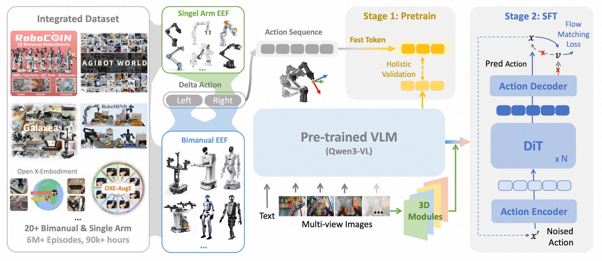

<div align="center">


<h1>ABot-M0: VLA Foundation Model for Robotic Manipulation with Action Manifold Learning</h1>

<p align="center">
  <b>AMAP CV Lab</b>
</p>


<p align="center">
  <a href="https://arxiv.org/abs/2602.11236"></a>
  <a href="https://amap-cvlab.github.io/ABot-Manipulation/"></a>
  <!-- <a href="https://huggingface.co/...."></a>
  <a href="https://modelscope.cn/...."></a> -->
    <a href="https://huggingface.co/...."></a>
  <a href="https://modelscope.cn/...."></a>
</p>

</div>


## 🌟 ABot-M0 is a general-purpose robotics model with the following core highlights:
<div style="text-align: center;">
  
</div>

- **Massive & Unified Data:** It integrates over 6 million open-source trajectories to form the largest unified dataset for robotic manipulation, providing a strong foundation for generalization.

- **Innovative Action Paradigm:** It pioneers Action Manifold Learning (AML), which directly predicts clean actions instead of noise, resulting in a more efficient and stable model.

- **Modular 3D Perception:** It supports plug-and-play modules to enhance 3D spatial understanding, improving execution precision for complex tasks.

---

## 📢 News
[2026-2-11] 🥳🥳**ABot-M0**'s [technical report](https://arxiv.org/abs/2602.11236) have been released. Weights and codes are coming soon. 🎉🎉

---


## 📜 Citing

If you find **ABot** is useful in your research or applications, please consider giving us a **star** 🌟 and **citing** it by the following BibTeX entry:

```
@article{yang2026abot,
  title={ABot-M0: VLA Foundation Model for Robotic Manipulation with Action Manifold Learning},
  author={Yang, Yandan and Zeng, Shuang and Lin, Tong and Chang, Xinyuan and Qi, Dekang and Xiao, Junjin and Liu, Haoyun and Chen, Ronghan and Chen, Yuzhi and Huo, Dongjie and others},
  journal={arXiv preprint arXiv:2602.11236},
  year={2026}
}
```

---
